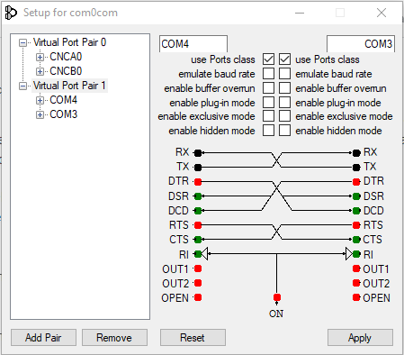
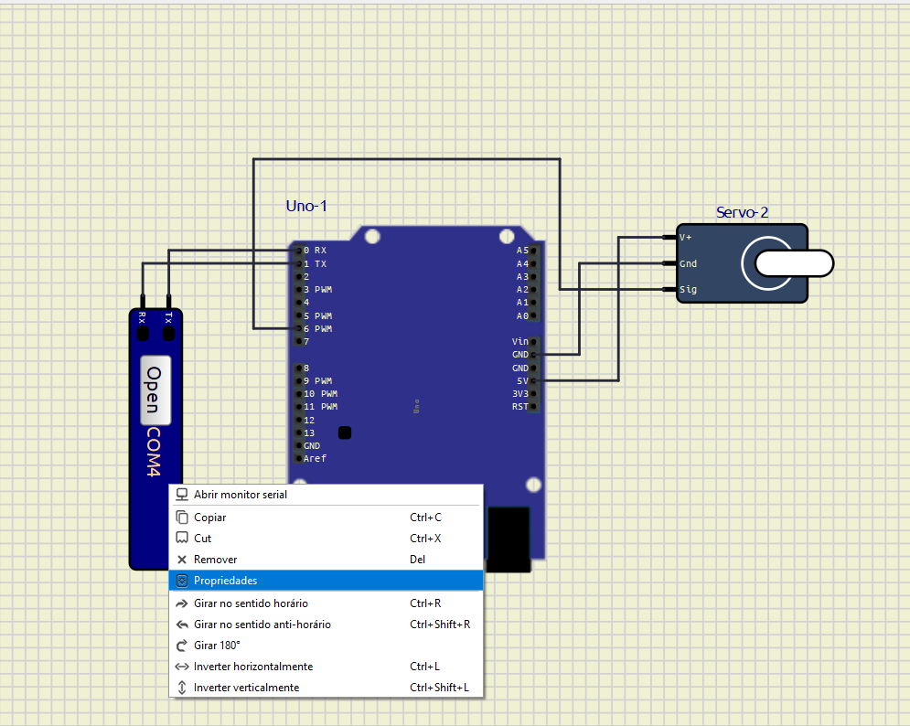
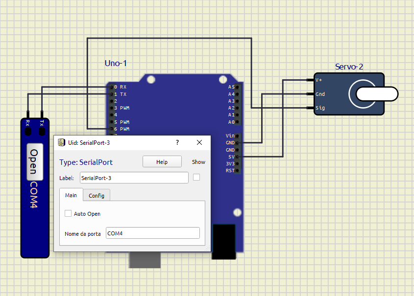

# Guia de Instalação e Execução do Projeto

## 1. Introdução

Este projeto utiliza o **MediaPipe** para reconhecimento de mãos e controle de um **servo motor** via **Arduino**. O circuito pode ser simulado no **SimulIDE** e requer a configuração de portas seriais virtuais utilizando o **com0com**.


---

## 2. Teste do MediaPipe

Para testar o **MediaPipe**:

1. No Google, pesquise **MediaPipe** e acesse o site oficial.
2. No menu esquerdo, selecione **Detecção de Objetos** > **Visão Geral**.
3. Clique em **Testar**.
4. O ambiente de teste permitirá visualizar o reconhecimento de mãos.

---

## 3. Instalação das Bibliotecas Necessárias

### **Se estiver usando os computadores da FIAP:**

1. Abra o **Anaconda Navigator**.

2. No **CMD.exe Prompt**, execute os seguintes comandos:

### **Se estiver no seu próprio computador:**

No terminal, execute:

```sh
pip install opencv-python
pip install matplotlib
pip install notebook
pip install pyserial  # Integração do Arduino com Python
pip install mediapipe
pip install --upgrade mediapipe opencv-python numpy
pip install matplotlib opencv-python notebook pyserial mediapipe
```

## 4. Componentes Usados no Circuito

Os seguintes componentes são utilizados no projeto:

- **Arduino Uno**
- **Servo Motor**
- **Porta Serial**

O circuito montado no SimulIDE ficará assim:


## 5. Configuração do SimulIDE

Para importar o firmware **.hex** no SimulIDE, siga os passos abaixo:

1. No **Arduino IDE**, vá em **Sketch** > **Export Compiled Binary**.

   

2. No **SimulIDE**, clique com o botão direito sobre o **Arduino Uno**. Selecione **mega328-109** > **Carregar Firmware**.

   

## 6. Configuração das Portas Seriais Virtuais

Como estamos utilizando o **SimulIDE** em vez de um Arduino físico, é necessário usar o **com0com** para emular portas seriais.

### **Passos para configurar o com0com:**
1. Abra o **com0com** e verifique quais portas estão sendo utilizadas.
2. No exemplo abaixo, as portas **COM3** e **COM4** estão sendo usadas:

   

### **Configuração da Porta Serial no SimulIDE:**
1. Clique com o botão direito na **Serial Port** e selecione **Propriedades**.
   
   

2. Em **Nome da Porta**, insira **uma das portas informadas pelo com0com** (exemplo: **COM4**).

   

### **Configuração da Porta Serial no Código**
No arquivo **arduino.py**, edite a linha **9** para corresponder à outra porta informada pelo com0com (exemplo: **COM3**):

```python
arduino = serial.Serial('COM3', 9600, timeout=1)
```

## 7. Usando Webcam ou MP4

O código principal é **arduino.py**.

Existem duas formas de rodar o código, dependendo da entrada de vídeo desejada.

### **1. Usar a Webcam**
Se deseja utilizar a webcam para detecção, altere a linha **22** do código **arduino.py**, substituindo `video_path` por `0`:

```python
cap = cv2.VideoCapture(0)
```

### **2. Usar um Vídeo MP4**
Caso prefira utilizar um vídeo pré-gravado, mantenha a variável `video_path`

```python
cap = cv2.VideoCapture(video_path)
```

## 8. Executando o Código
O código detecta a posição do dedo indicador e envia comandos para o Arduino via porta serial. Se o dedo estiver acima do ponto médio da tela, o motor será ajustado para 90°; se estiver abaixo, será ajustado para 180°.

```python
if index_finger_y < 0.5:  # Dedo levantado
    arduino.write(b'1')  # Move para 90°
else:  # Dedo abaixado
    arduino.write(b'2')  # Move para 180°
```
1. Certifique-se de que o SimulIDE está configurado corretamente e que as portas seriais foram ajustadas.

2. Execute o código arduino.py no terminal:
    ```sh
    python arduino.py
    ```

## 9. Observações Finais

* Caso o vídeo não abra, verifique se o arquivo MovimentacaoServo.mp4 está localizado corretamente em assets/vdo/.
* Para problemas com portas seriais, certifique-se de que com0com está configurado corretamente.
* Para problemas com portas seriais, certifique-se de que com0com está configurado corretamente.
