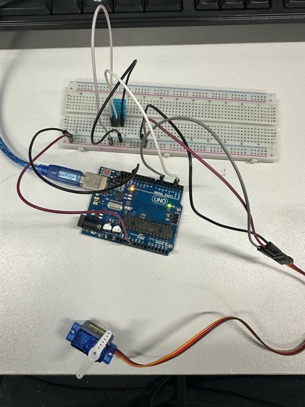
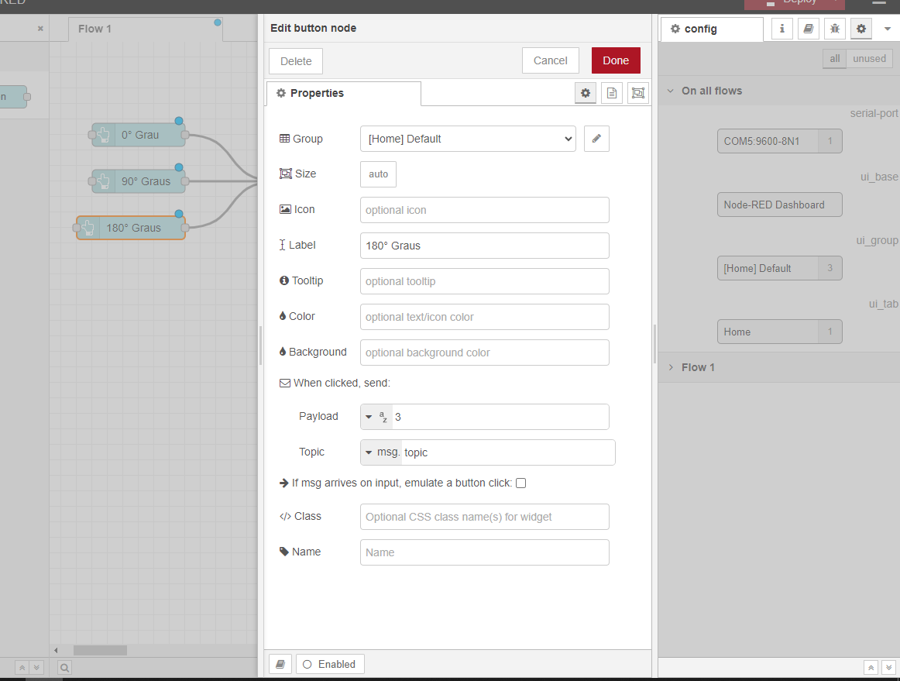
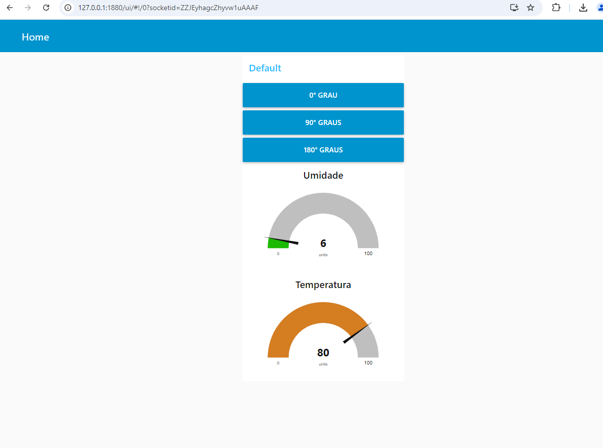
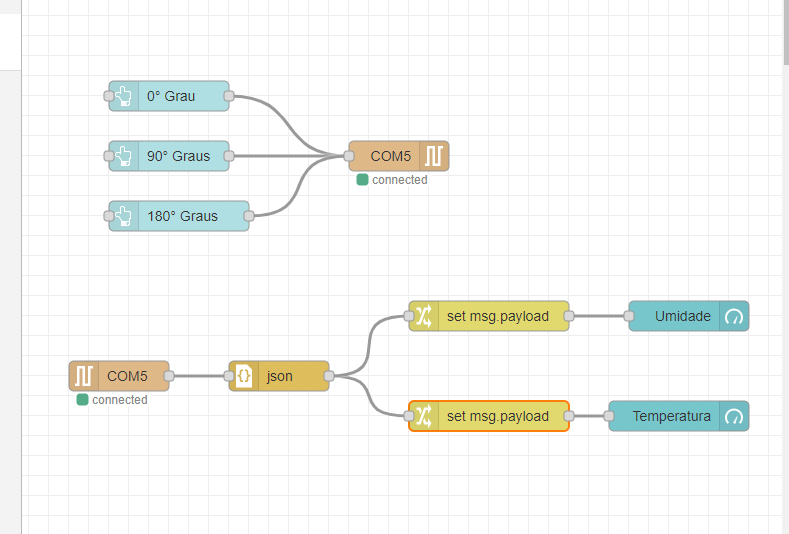
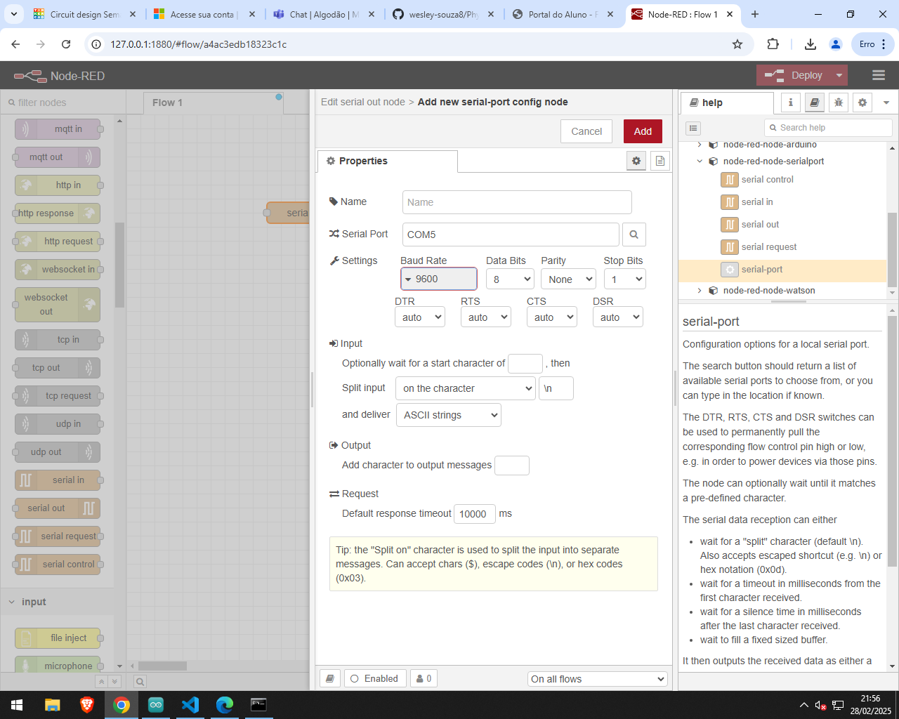

# Projeto Checkpoint 1

## Integrantes
- Eduardo Akira Murata - 98713
- Wesley Souza de Oliveira - 97874
- Pedro Henrique Moraes - 98804

## Descrição do Projeto
Este projeto implementa a leitura de um sensor DHT11 e o controle de um servo motor utilizando Arduino e Node-RED.

## Estrutura dos Arquivos

### Código-Fonte
- **`CP-01.c++`**: Arquivo principal contendo a lógica do sistema.

### Fluxo do Sistema
- **`flows.json`**: Representação do fluxo do sistema em formato JSON.

### Leitura do Sensor DHT11
- Leitura realizada a cada 3000ms.
- Dados disponibilizados na porta serial.
- Valores exibidos no DEBUG do Node-RED.
- Utiliza a biblioteca **ArduinoJson** para formatação dos dados.

### Controle do Servo Motor pela Serial
- Controle de três ângulos diferentes.
- Implementado com `Serial.available()`.

### Dashboards no Node-RED
- Exibição gráfica dos valores de:
  - Temperatura atual (em Fahrenheit).
  - Umidade atual.

### Botões para Controle do Servo Motor
- Três botões na interface do Node-RED para selecionar diferentes ângulos.

## Como Executar o Projeto
1. Instale os requisitos necessários no Arduino e no Node-RED.
2. Compile o arquivo `CP-01.c++` e faça o upload para a placa.
3. Inicie o Node-RED e importe `flows.json`.
4. Monitore os valores na interface gráfica.

## Conclusão
Este projeto integra sensores e atuadores via Arduino, utilizando Node-RED para exibição de dados e controle do sistema.

