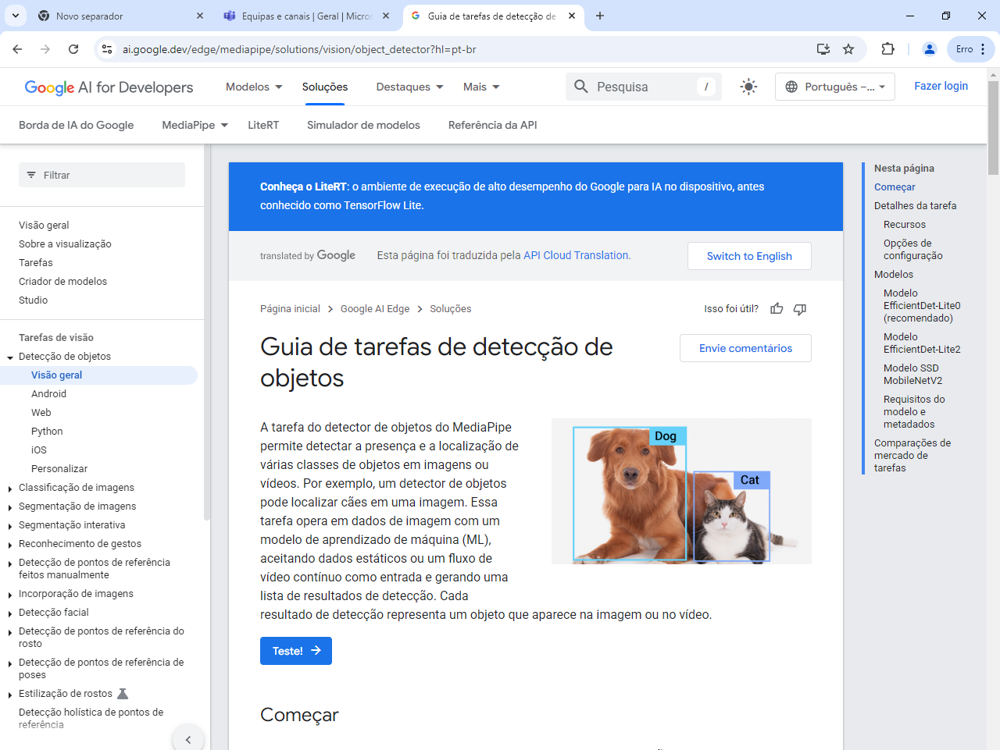

# 📚 Guia de Instalação e Execução do Projeto

## OWNER

- Deivison Pertel - RM 550803
- Eduardo Akira Murata - RM 98713
- Wesley Souza de Oliveira - RM 97874

## 1. Introdução

Este projeto utiliza o **MediaPipe** e **OpenCV** para **detecção de vogais em Libras** através da análise da posição dos dedos da mão.



Também disponibilizamos um vídeo de **demonstração e explicação** do projeto:  
- 📂 O vídeo está localizado em `assets/video/apresentacao.mp4`
- 📺 Você também pode assistir diretamente pelo YouTube: [Assista aqui](https://youtu.be/ED3tPcmcSwM)

---

## 2. Instalação das Bibliotecas Necessárias

No terminal (CMD, Terminal ou Anaconda Prompt), execute os seguintes comandos para instalar as bibliotecas necessárias:

```sh
pip install opencv-python
pip install mediapipe
```

Essas duas bibliotecas são suficientes para executar o projeto.

---

## 3. Estrutura do Projeto

- **assets/**  
  Pasta que contém vídeos e imagens utilizadas no projeto:
  - `video/mao_direita.mp4` — vídeo de exemplo para reconhecimento.
  - `video/apresentacao.mp4` — vídeo de apresentação do projeto.
  - `img/MediaPipe.png` — imagem ilustrativa.

- **libras.py**  
  Código principal que faz a detecção das vogais.

---

## 4. Funcionamento do Código

O código principal (`libras.py`) detecta a configuração dos dedos da mão para identificar vogais específicas:  
**A**, **E**, **I**, **O** ou **U**.

Ele oferece duas opções de entrada:
- 📷 **Usar Webcam** em tempo real;
- 🎥 **Usar Vídeo MP4** pré-gravado.

Você seleciona a opção ao rodar o código.

---

## 5. Como Rodar o Projeto

### 5.1. Passos:

1. Certifique-se de que você tenha o Python instalado (versão 3.7 ou superior).
2. Instale as bibliotecas necessárias conforme mostrado no item 2.
3. Organize o arquivo de vídeo (`mao_direita.mp4`) dentro da pasta `assets/video/`.
4. Execute o arquivo `libras.py`:

```sh
python libras.py
```

5. Escolha uma das opções:
    - Digitar `1` para usar a Webcam
    - Digitar `2` para usar o vídeo MP4

---

## 6. Lógica de Reconhecimento

O algoritmo compara a posição dos dedos:
- **Polegar**, **Indicador**, **Médio**, **Anelar** e **Mindinho**.
- Baseado na posição relativa (se estão levantados ou abaixados), identifica a vogal correspondente.

As vogais reconhecidas são exibidas na tela com o OpenCV (`cv2.putText`) e também impressas no console (`print`).

---

## 7. Observações Importantes

- Para usar **Webcam**, certifique-se de que a câmera esteja funcionando e liberada para o Python.
- Para usar **vídeo MP4**, confirme se o caminho e o nome do arquivo estão corretos dentro da pasta `assets/video/`.
- Para a **mão esquerda**, é necessário ajustar o código na função `is_polegar_open` (trocar a comparação `>` para `<`).

---

# 📢 Resumo rápido:
| Ação                         | Como Fazer                           |
|-------------------------------|--------------------------------------|
| Instalar bibliotecas          | `pip install opencv-python mediapipe` |
| Executar o projeto            | `python libras.py`                   |
| Escolher entrada de vídeo     | Digitar `1` (webcam) ou `2` (vídeo)   |
| Assistir demonstração         | [Vídeo no YouTube](https://youtu.be/ED3tPcmcSwM) |
