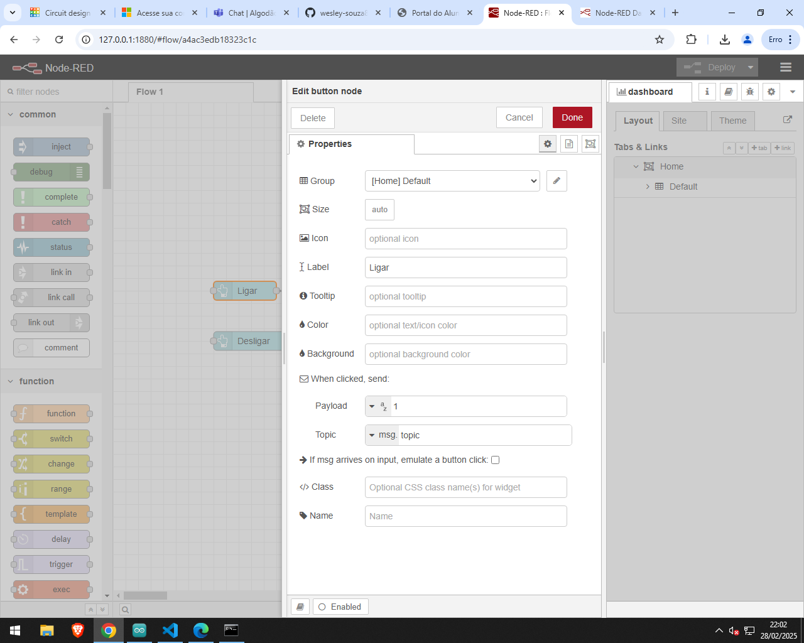
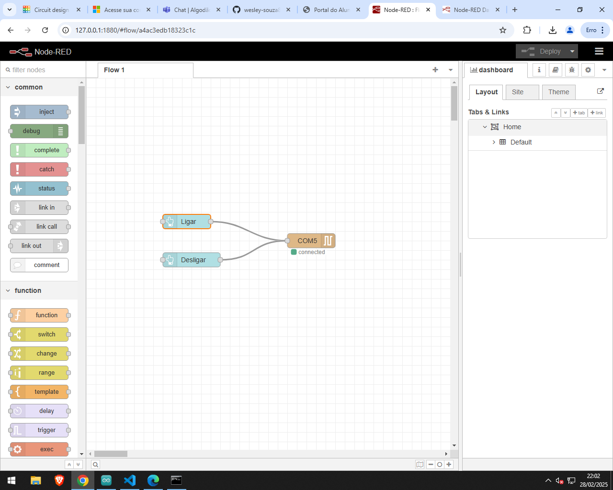
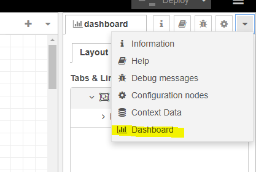
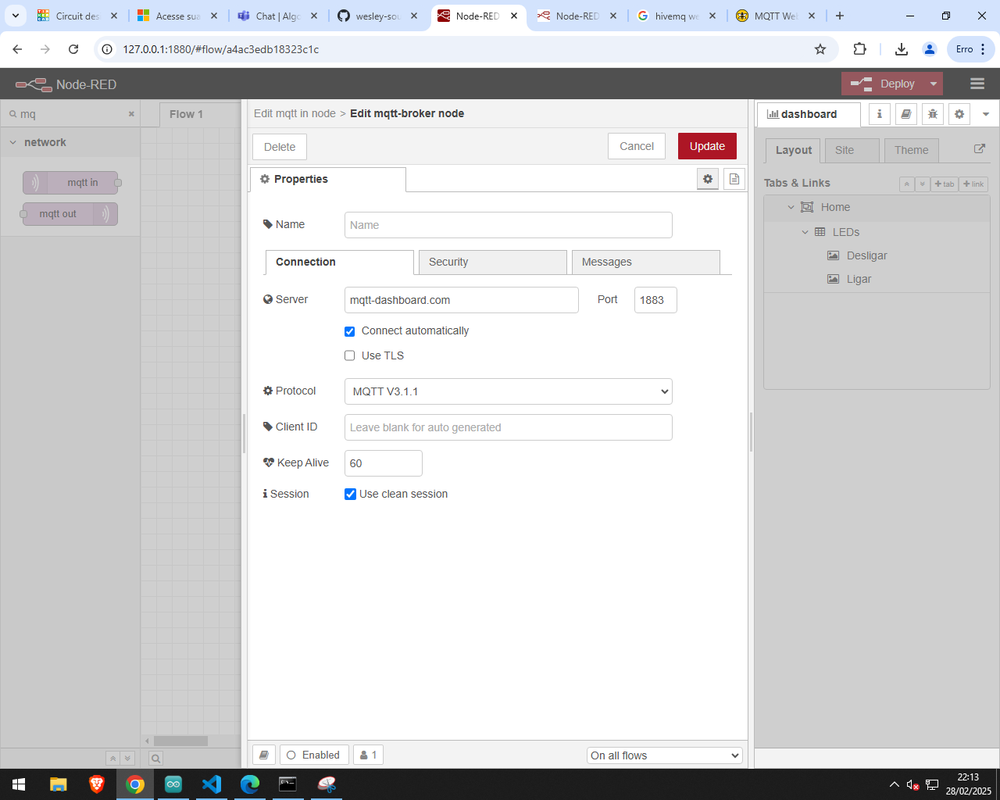
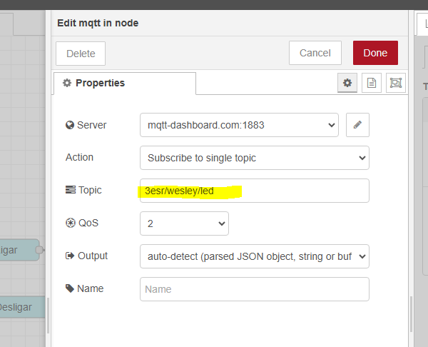
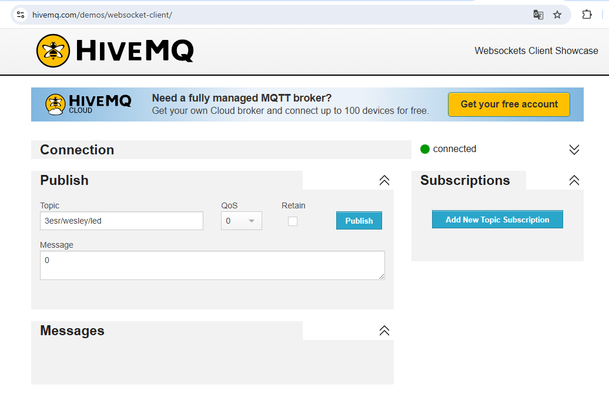

# Tutorial: Configuração do Node-RED com MQTT para Controle de LED

## Iniciando o Node-RED

1. **Iniciar o Node-RED**:
   - No terminal, execute o seguinte comando para iniciar o Node-RED:
     ```bash
     node-red
     ```
   - Copie o link fornecido no terminal, geralmente será algo como `http://localhost:1880`. Abra esse link no seu navegador.

## Configurando o Node-RED para Controlar o Arduino

2. **Adicionar o nó "serial out"**:
   - No ambiente do Node-RED, procure pelo nó `serial out`.
   - Arraste o nó para o fluxo e configure a **Serial Port** em que o Arduino está conectado (por exemplo, `COM5`).
   - Defina o **Baud Rate** para `9600`.

   **Configuração Serial Out**

3. **Adicionar os botões para controlar o LED**:
   - Procure pelo nó `button` e adicione dois botões (um para **ligar** o LED e outro para **desligar**).
   - Conecte cada botão ao nó **serial out**. No primeiro botão, defina o **Payload** para o valor que acende o LED (por exemplo, `1`), e no segundo botão, defina o **Payload** para o valor que apaga o LED (por exemplo, `0`).
   
   Para configurar o **Label** do botão, você pode colocar algo como **"Ligar"** no primeiro e **"Desligar"** no segundo.

   **Configuração dos Botões**

### Estrutura Final do Fluxo

O fluxo completo no **Node-RED** deve se parecer com isso:


4. **Configuração do Dashboard**:
   - Para acessar o **dashboard**, clique no ícone no canto superior direito (abaixo de **Deploy**), em seguida, clique em **Dashboard**.
   - Isso abrirá a interface de controle do dashboard onde você pode personalizar os botões, como cor e tamanho.
   - Você também pode acessar o dashboard diretamente em `http://localhost:1880/ui`.

   **Acessando o Dashboard**
   
   

## Adicionando Conexão com MQTT

5. **Adicionar o nó `mqtt-in`**:
   - Agora, para integrar o MQTT, procure e adicione o nó `mqtt-in`.
   - Conecte esse nó aos dois botões. 
   - Clique no lápis no nó `mqtt-in` para configurar a conexão com o broker MQTT.
   - Configure o **Servidor** para `mqtt-dashboard.com` na porta `1883`, ou qualquer outro servidor MQTT que você tenha acesso.

   **Configuração do MQTT**

6. **Configuração do Tópico MQTT**:
   - No nó `mqtt-in`, configure o **Tópico** como, por exemplo, `3esr/wesley/led`. Esse será o tópico em que o Node-RED vai escutar para controlar o LED.
   - No **Publish** do HiveMQ (explicado mais abaixo), você usará esse tópico para enviar as mensagens.

   **Configuração do Tópico MQTT**

## Testando a Conexão MQTT com HiveMQ

7. **Usar o WebSocket Client do HiveMQ**:
   - Abra o navegador e acesse o **HiveMQ WebSocket Client**

   
   - Clique em **Connect** sem alterar nenhuma configuração.
   - Após conectar, vá em **Publish** e insira o **Tópico** definido anteriormente (`3esr/wesley/led`) e a mensagem que você deseja enviar (por exemplo, `1` para ligar e `0` para desligar o LED).
   - Clique em **Publish** para enviar a mensagem.

   **Publicando no HiveMQ**